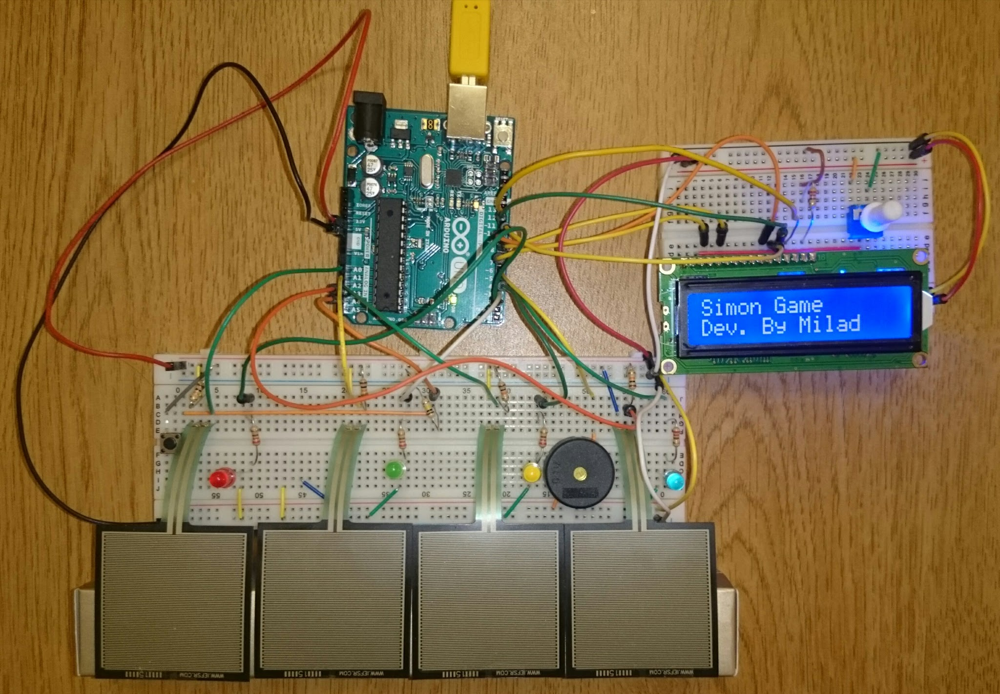
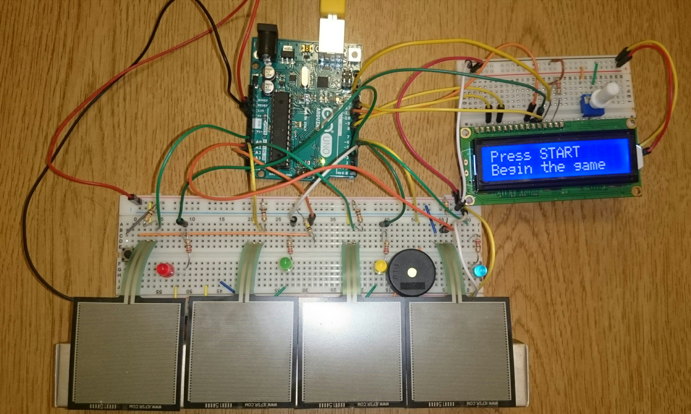
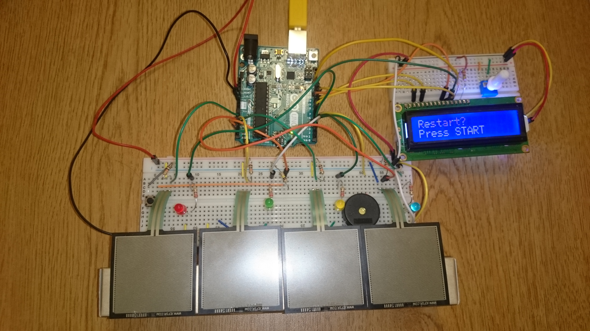
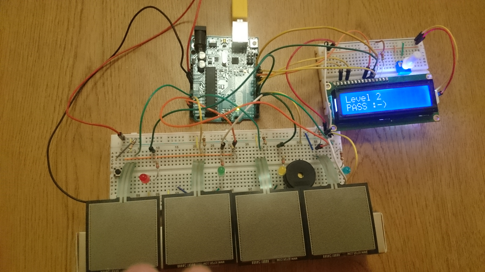
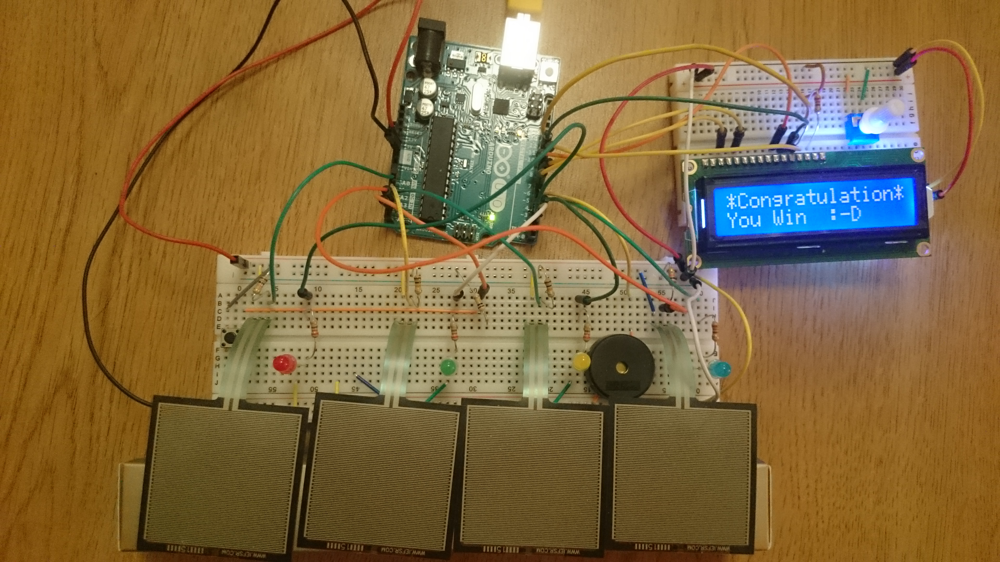
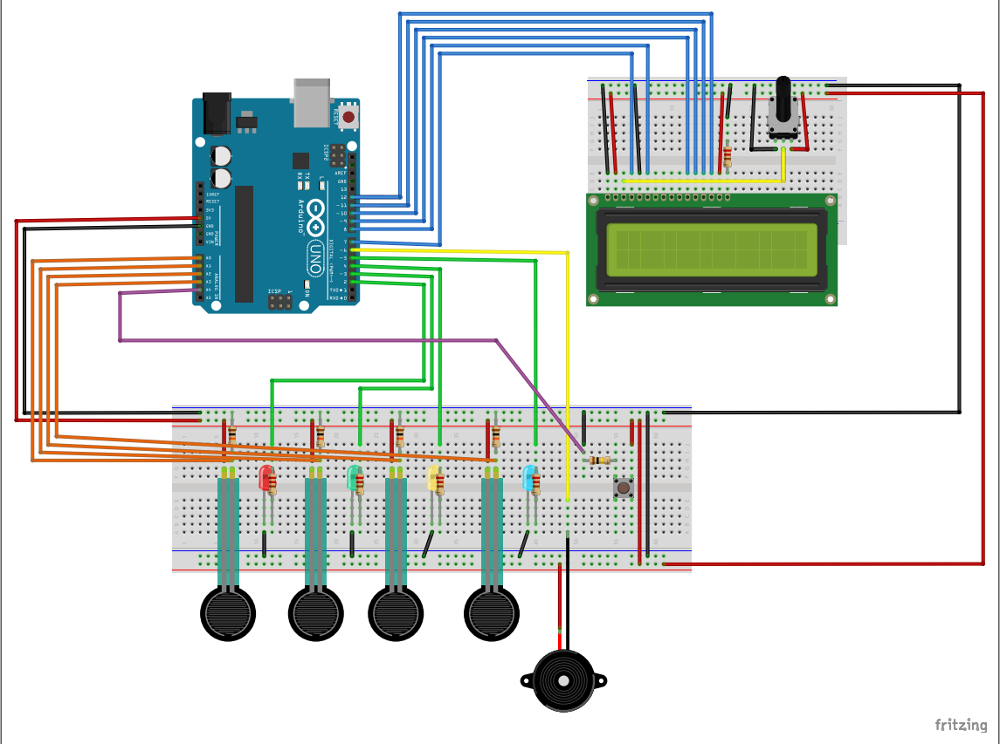

# Simon Game
## Illinois Tech - Spring 2018

## Description
This project replicates the Simon Game with Arduino Platform.

## Features

### Start / Restart Button
At beginning player should push the pushbutton. this button connects to A5 analog pin on Arduino.

### Display all states
The LCD shows the status of the game in each state. It includes Levels, PASS/FAIL, GameOver, Victory, Restart

#### Example 1

#### Example 2

#### Example 3

## Additional Features

### Clock Simulation
This project simulates the clock. It means that player should finish each level in specific period of time. If he cannot finish the current level in specific duration the game goes to GAMEOVER state. In this state, program shows a message on LCD that if player wants to start again, he has to push the start button.

### Change the LCD Contrast
This project use one Potentiometer to change the contrast of the LCD

## Diagram
The diagram of the board looks like this

