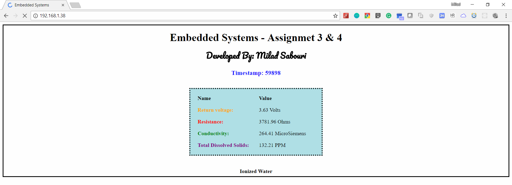
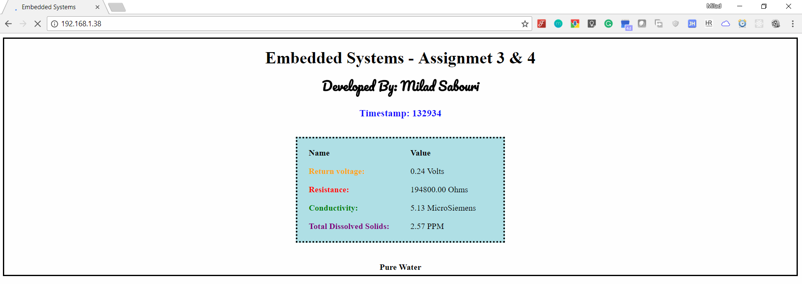
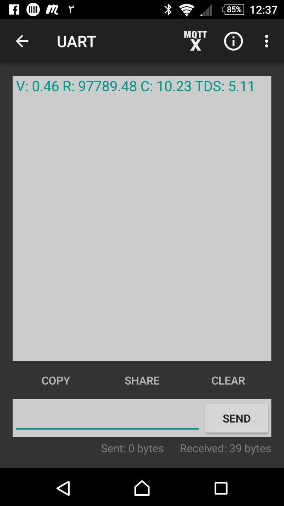

# Assignment 3 & 4
## Illinois Tech - Spring 2018

## Description
This project use Probe to find the conductivity of pure water and ionized water. According to it, shows the values including Voltage, Conductivity, Resistance, and TDS in the Serial. Also, uses the Arduino Ethernet Shield to send the values to Web Server. Moreover, it uses Bluetooth to transmit the values to Smart Phone. In addition, it saves all data to on-board SD card based on Timestamp.  

## Features

### Start / Restart Button
At beginning player should push the pushbutton. this button connects to A5 analog pin on Arduino.

### Display all states
The LCD shows the status of the game in each state. It includes Levels, PASS/FAIL, GameOver, Victory, Restart

#### Show Data on Smart Phone Using Bluetooth

#### Show Data on Smart Phone Using Bluetooth

#### Example 3

## Additional Features

### Clock Simulation
This project simulates the clock. It means that player should finish each level in specific period of time. If he cannot finish the current level in specific duration the game goes to GAMEOVER state. In this state, program shows a message on LCD that if player wants to start again, he has to push the start button.

### Change the LCD Contrast
This project use one Potentiometer to change the contrast of the LCD

## Diagram
The diagram of the board looks like this

