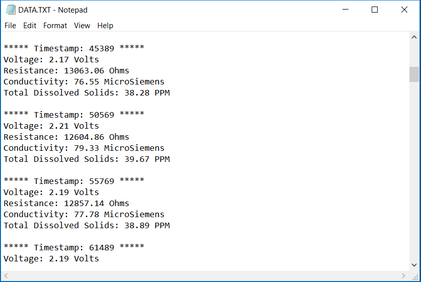
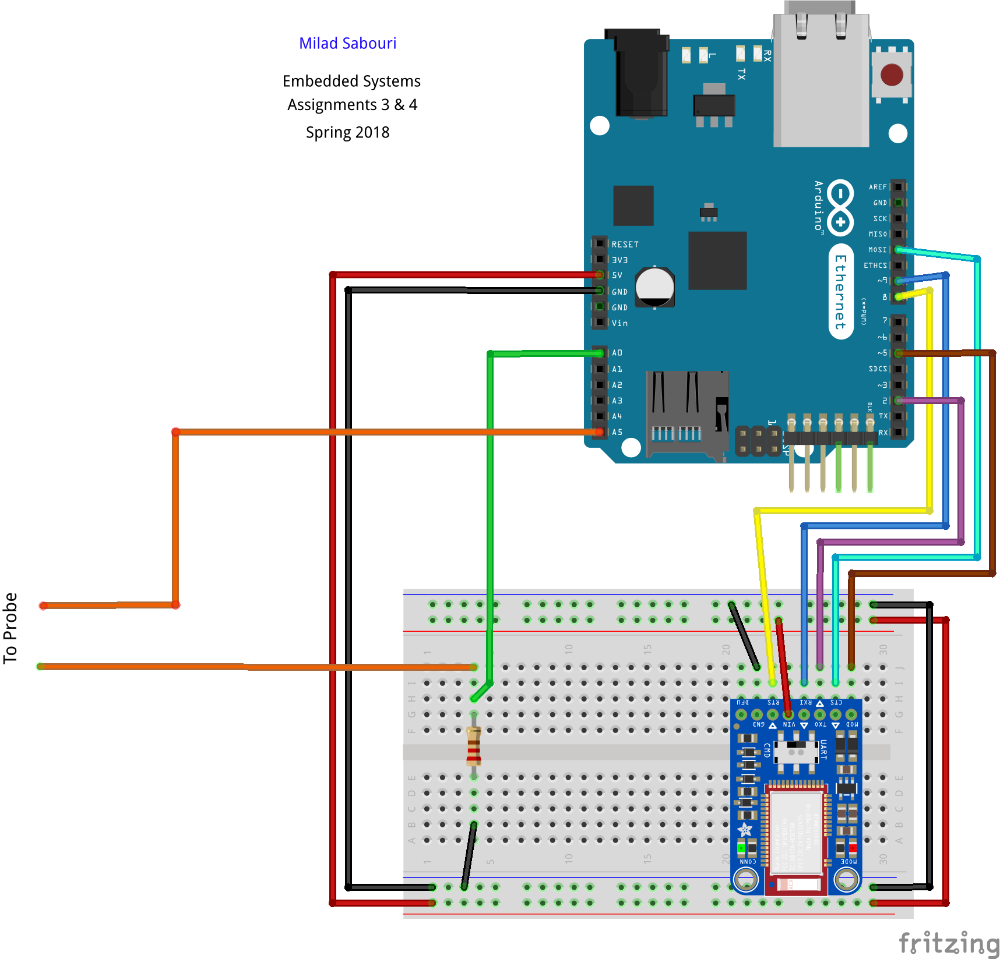

# Assignment 3 & 4
## Illinois Tech - Spring 2018

## Description
This project use Probe to find the conductivity of pure water and ionized water. According to it, shows the values including Voltage, Conductivity, Resistance, and TDS in the Serial. Also, uses the Arduino Ethernet Shield to send the values to Web Server. Moreover, it uses Bluetooth to transmit the values to Smart Phone. In addition, it saves all data to on-board SD card based on Timestamp.  

## Features
* Use Ethernet Shield to connect to the network and send data to web server
* Use Bluetooth to transmit data to smart Phone
* Use on-board SD card to save the data

### Results for Ionized Water

### Results for Pure Water

#### Show Data on Smart Phone Using Bluetooth

#### DATA.txt File which is saved by on-board SD card

## Diagram
The diagram of the board looks like this

