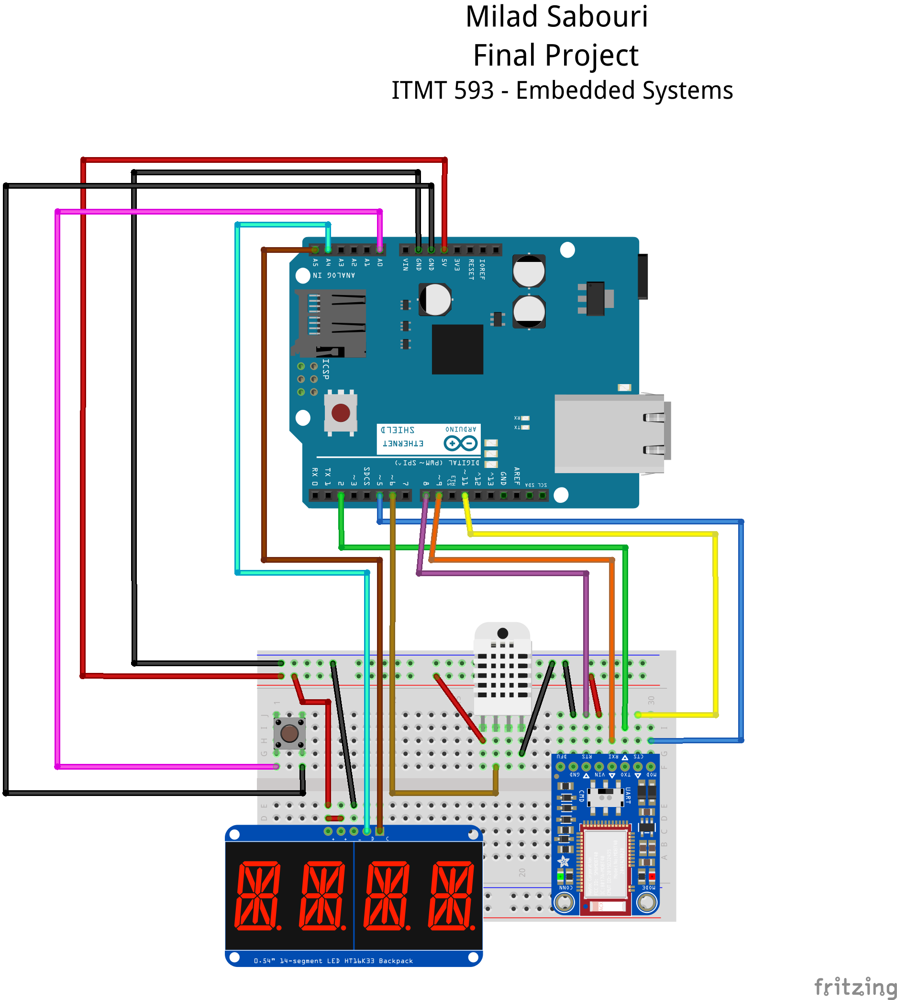

# Final Project
## Embedded Systems Course (Introduction to Smart Technologies)
## Illinois Tech - Spring 2018

## Description
In this project I developed an electronic working prototype that covering *Data Collection*, *Data Transmission*, and *Data Presentation* phases.
The micro-controller board which is used in this project is Ardino-UNO. 

In Data Transmission phase, DHT22 sensor is used. It is a basic, low-cost digital temperature and humidity sensor.

In Data Transmission phase, both Arduino Ethernet Shield and Adafruit BLUEFRUIT LE UART are used to transit data with network cable and Bluetooth respectively.

In Data Presentation phase, I have used web server to present the data which are transmitted with network cable. Also, I have used android application to present the data that are transmitted via Bluetooth.
Moreover, I have used 14 segment LED to present the temperature.

## Features
* Use DHT22 sensor to **collect** temperature and humidity
* Use Ethernet Shield to connect to the network and **transmit** data to a web server.
* Use Bluetooth to **transmit** data to smart Phone
* Use 14-segment alphanumeric LED to **present** the data

### Web Server

### Bluetooth

### Show Data on 14-segment alphanumeric LED

## Diagram
The diagram of the board looks like this

