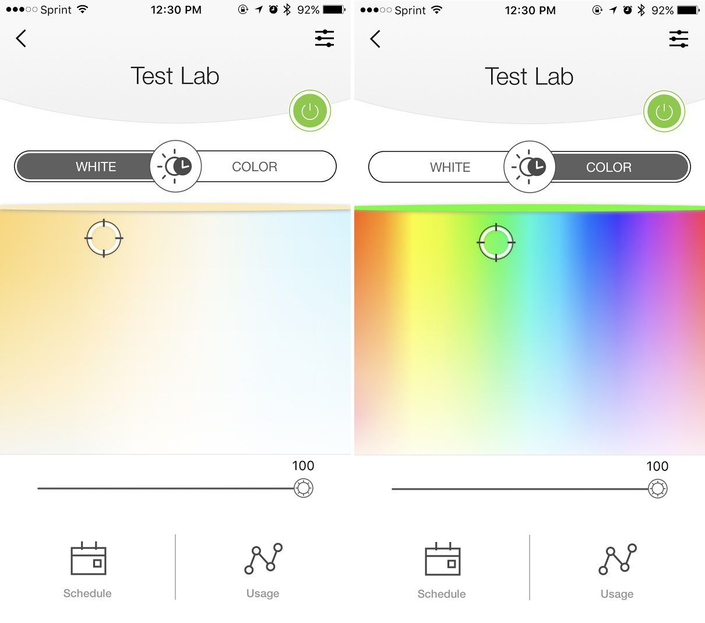

# Smart Device Presentaion
# Smart Wi-Fi LED Bulb
#### Milad Sabouri
#### Embedded Systems
#### Illinois Tech - Spring 2018

## TP-Link LB130
It uses its own built-in Wi-Fi radio to connect directly with your home's router.
## Easy to use
Screw in - turn on - sync up
## Application
It works with both Android and iOS

## Video Link
https://www.youtube.com/watch?v=JJ9NNbS9sYI

## Specifications

