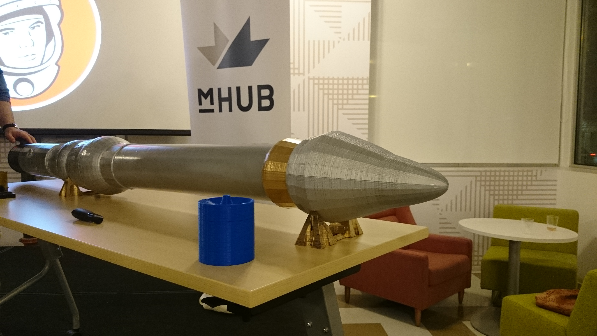

# Meetup Report NewSpace Chicago

## Subject: Failing Fast, Launching Often

##### Link: http://www.newspacechicago.com/2018/03/22/event-thu-4-12-failing-fast-failing-often/
###### When: Thursday, April 12, 2018 - 6:00 PM to 9:00 PM
###### Where: mHUB Chicago event space

### Short summary and conclusion
The event was about usage of 3D-Printing in aerospace technologies. The speaker, Brian Stofiel, was an entrepreneur who established a startup which has developed a functional rocket nozzle that is printed using high grade 3D printing, and which is capable of carrying small payloads to high altitude. 
The startup is called Stofiel Aerospace which is located in St. Louis. This new company create rocket nozzles with 3D-Printing. So, they are able to drive production times down to days instead of months. 
The rockets which are built with this type of nozzles can carry small payloads to high level altitude. Moreover, Stofiel Aerospace is offering a balloon-based small satellite launcher with unique capabilities for the educational, commercial, and governmental markets.
Their balloon carries the rocket to the atmosphere’s edge, allowing for launch site selections that would be, at best, impractical for a ground based launcher. This mobile launch system expands the range and options of orbits and missions of your payload. 
Providing on-demand launches on the site of a critical emergency situation gives you the ability to address geographically based mission needs.

One innovative action that the company does is they use 

 

 
### Observations and comments about the subject.
The event was very interesting to me. Although the event included many technical aspects which were not very related to my field, I enjoyed it because I learned at least to important things:
* Always keep going and try again and again. Having small failures can teach you about future steps so, don't worry about failures. 
* At first, when I read the event's poster and found out that the startup using 3D-Printing to create the rocket nozzle I thought it is impossible. At the event I realize that the entrepreneur with a creative mind could create rocket nozzles with 3D-Printing technology.
It is precise, fast, and cheap. It works for small payloads (between 15kg and 250kg) well. So, it is very important to know about technologies and have a creative mind to use the correct technology in a correct place.

