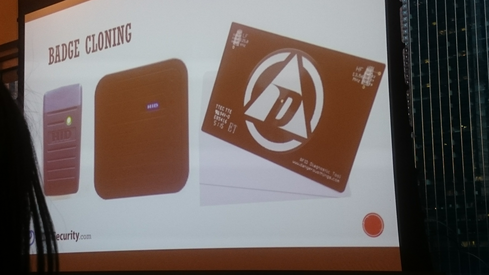
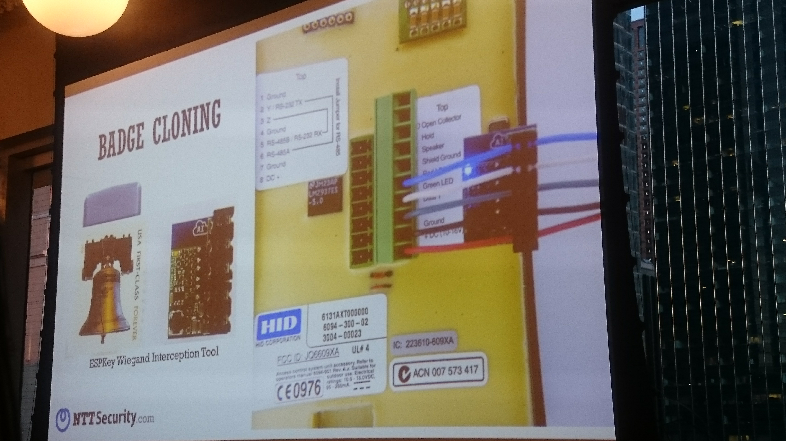

# Meetup Report #2

## Subject: **A Hacker's Guide to Unauthorized Physical Access**

## Name of Group: **EvolveSec - CyberSecurity**

###### When: Thursday, April 19, 2018 - 6:30 PM to 8:00 PM
###### Where: WeWork River North, 111 West Illinois Street · Chicago, IL
###### Link: https://www.meetup.com/EvolveSec/events/248973309/

### Short summary and conclusion

The event was about security weaknesses and the effect of social engineering to bypass the security controls and security devices such as RFID.
 

 
This event was held by EvolveSec meetup. Usually, the meetups for this group are for anyone interested in learning about cyberSecurity, starting a career in the cyberSecurity industry, or just networking with other cyberSecurity industry professionals.

In fact, Evolve Security is a dedicated Cyber Security services firm that focuses on delivering real and measurable improvements security posture.
Evolve Security's expertise is within Application Security, Penetration Testing, and Security Training through its Academy.
 

 
### Observations and comments about the subject.

In my opinion, it was a unique event because the speaker tried to explain security in a different aspect.
The point that I learned in this event was that even if we create every smart technologies oriented in a perfect way, still there are a lot of weaknesses if we don't attention to social engineering and educating the people who work with the technologies. 

In other words, the hackers can penetrate to strong secure systems easily with the help of social engineering techniques. 

Therefore, when experts create one smart technology-based product perfectly, they must make sure that they train the users of that product perfectly too in order to prevent social engineering attacks.
 