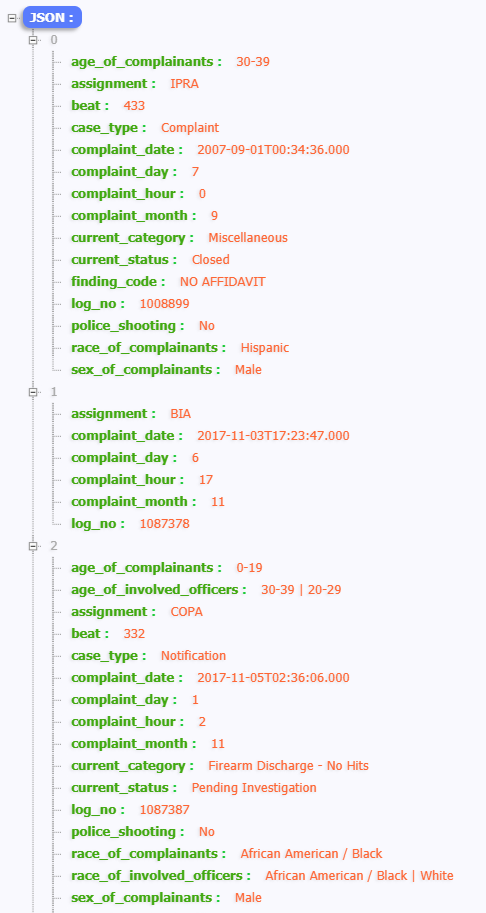
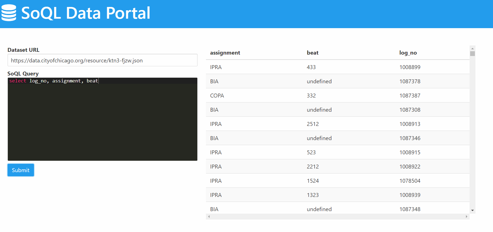

# Meetup Report #1

## Name of group and subject: Paul V. Galvin Library: Exploring Chicago’s Data

##### Link: https://iit.edu/news/iittoday/?p=71914
###### When: Wednesday, February 28, 2018 - 12:45 to 1:45 PM
###### Where: Library Learning Center, Galvin Library, Illinois Institute of Technology · Chicago, IL

### Short summary and conclusion
In this meeting, we learned how to explore Chicago government data through the Chicago Data Portal. We were introduced to the portal, its platform Socrata, and walked through projects using open data.
The Socrata provides open source public data. With *data.cityofchicago.org* we can access to open data in JSON format. For example, https://data.cityofchicago.org/resource/ktn3-fjzw.json provides open source public data about crimes in Chicago

#### Sample of data in JSON format
 

We can use https://vingkan.github.io/soql/ website to do queries on the dataset. For example, as you can see in the below picture I selected three columns from the dataset.
I used *SELECT* command to filter just three column.

We can find a list of all commands in the *https://dev.socrata.com/docs/functions/#2.1*
We can Also use the *cvs* format of the data or just used the original *json* format to precess the data. 

 
### Observations and comments about the subject.
It was a good meeting. The meeting brought me a chance to be familiar with open public data and how to query them with free on-line tools. 
Also, this meeting was a kind of workshop and we tried every instruction and commands in the workshop.