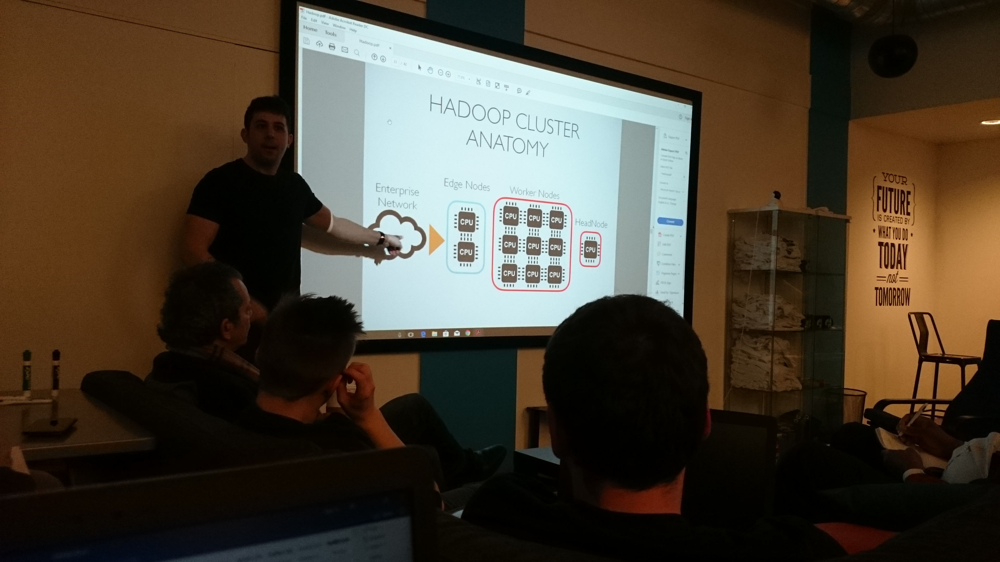
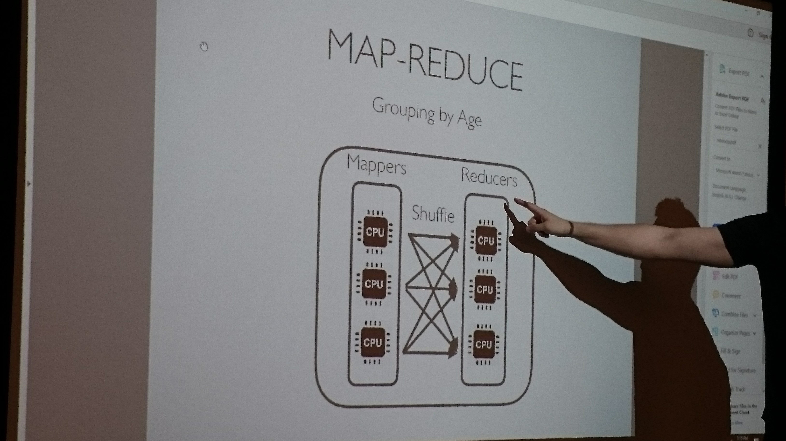
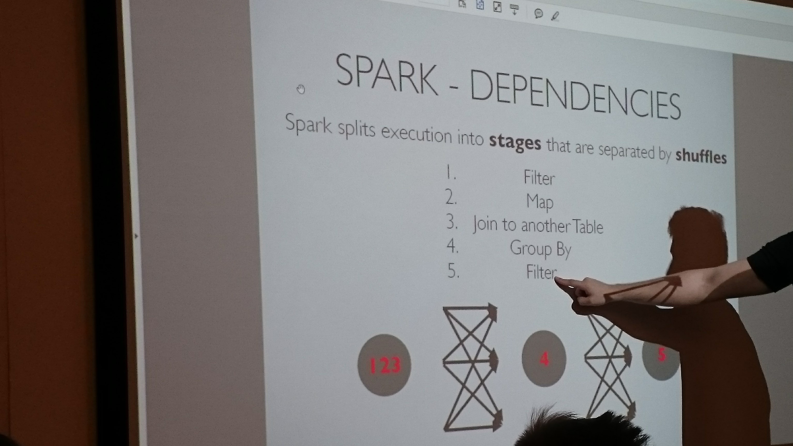

# Meetup Report #2

## Subject: **Introduction to Distributed Big Data Processing with Hadoop**

## Name of Group: **Coding Temple**

##### Link: https://www.meetup.com/Coding-Temple/events/248694833/
###### When: Wednesday, April 4, 2018 - 6:00 PM to 9:00 PM
###### Where: 222 W. Ontario Street, Suite 450 · Chicago, IL

### Short summary and my conclusion

This meetup included two sections: 
* The first section was about the concept of MapReduce and intruduction to Distributed File System and Hadoop. The speaker first talked about the cluster architecture 
and then introduced concept of distibuted file systems. He explained the basic operations in relational datacases such as Filter, Join, and Aggregation (Group By) with the concept of distributed file system and MapReduce.
For example he described that because rows are independent in Hadoop, usually we don't need to join in datasets.

#### Hadoop Cluster

#### MapReduce

#### Conclusion
Working with big data and processing it is one of the most hot challengeable topics in data management world. Hadoop and the next generation of it, Spark, have the important role in this area.

* The second section was about introduction to Spark and showing some demo with Spark. Spark is a distributed real time analytics engine. Spark is the hottest topic in data management world.
Spark is very faster than hadoop. Spark workson distributed data which are stored on distributed file system paradigm like hadoop. Spark is based on Scala. 
Spark is based on laziness execution. It means that it doesn't do anything until it counters specific command like show() or write to disk. 

 

 
 ### My observations and comments about the subject.
 
 In my opinion, the meetup was very useful. I learned the following tips and concepts from this meeting:
 
 * Usually, in Hadoop we handle rows not column
 * If crash happens we do not need to start from the beginning
 * When something goes wrong, the Hadoop just handle that peace of job to fix it.
 * There are three different type of nodes in hadoop. Edge nodes which are not for actual processig. They are used to do other stuff such as commanf line like "hadoop fs -ls ..." not actual data processing. Worker nodes: The actual data processing do here. Head nodes: keep track of jobs and partion and something like that. Because of this noe hadoop have a lot of problems with large number of small files less than 128 MB.
 * Break the data to hadoop: hadoop fs -put /out/to/file
 * Merge data back: hadoop fs -getMerge path/to/dest/ path/to/file
 * In some cases that we need join or group by operations in hadoop, it needs shuffle process to do that.
 * **Apache Kafak:** is a distributed streaming platform.
 * Spark is a distributed real time analytics engine.
 