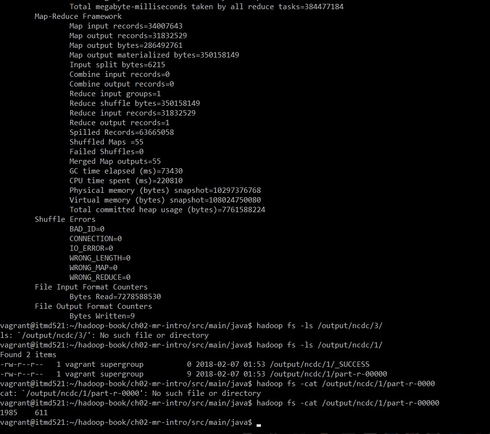
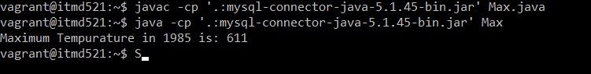

# ITMD 521 Spring 2018

## Week 4 assignment

Clone this repo to your system, add this file to a folder named Week-04 (mind the spelling) under ITMD-521 in your own private github repo

### Part I

* Insert the assigned datasets below into your local hadoop cluster 
  + A-E 1997.txt [1997.txt.xz](https://drive.google.com/open?id=0Bys2c__9q7eBNzhMNXdUSFpNYlk)
  + F-R 1950.txt [1950.txt.xz](https://drive.google.com/open?id=0Bys2c__9q7eBQVJnbXFMSkstMTQ)
  + S-Z 1985.txt [1985.txt.xz](https://drive.google.com/open?id=0Bys2c__9q7eBUUN4TkllRXFxYTg)
  + Note that the files are compressed with xzip - you will need to use the vagrant shared file options to get them into your vagrant box - see Week 4 Tuesday video 
* Insert the data into this directory structure /user/$USER/ncdc/19XX/  (with XX being your year)
* Compile the source code in chapter-02 of the text book sample code into a single jar file named: ```mt.jar```
  + Place all your scripts (but not the datafile!) into the Week-04 github folder
* Run the MaxTemperature class against your dataset
* Display the content of the part-r-00000 and capture that in a screenshot to be displayed below

### Part II

* In your Vagrant box, install mysql-server and give it the password: **itmd521**
* Install and configure the proper mysql-Java connector - [mysql/J connector](https://dev.mysql.com/downloads/connector/j/)
* Write a script in Python to parse the dataset given you (using schemea in Chapter 02) and insert this data into a database named: **521** and a table named: **records**
  + Assume that the dataset.txt file is in the same directory as the script being executed
* Write a Java Application that will perform the same funtionality as the MapReduce program to find the Max Temperature in SQL.
* Provide any instructions or additional dependencies needed at the bottom of this document
  + We will run your code to see if the results are as delvivered.
  + Place all your scripts (but not the datafile!) into the Week-04 github folder
* take a screenshot of the output 

### Deliverable Instructions

 [Clone my repo](https://github.com/illinoistech-itm/jhajek.git) and use this file as your template.   Add the required photo deliverables to the document as noted and submit your github URL to blackboard.

 Assume all work and code will be executed on the Vagrant Box

### Deliverable 1



### Devliverable 2



### Additional Notes
#### MySQL Notes
* **ATTENTION:** the *Table Name* in MySQL is "**itmd521**" because MySql didn't allow me to create a table with the name of 521

#### Python Notes
* I parsed the data and inserted them into MySQL using Python3 and mysql.connector. 
* To install mysql.connector I used "sudo apt-get install python3-mysql.connector"  

#### Java Notes
* I used JDBC driver to connect to MySQL (Class: com.mysql.jdbc.Driver -- File: mysql-connector-java-5.1.45-bin.jar)
* I use useSSL=false property to bypass ssl connection to MySQL
* The codes of https://dev.mysql.com/doc/connector-j/5.1/en/connector-j-examples.html helped me to write the codes.

