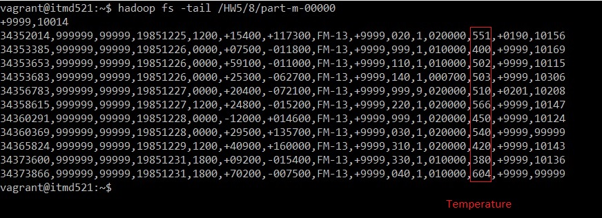
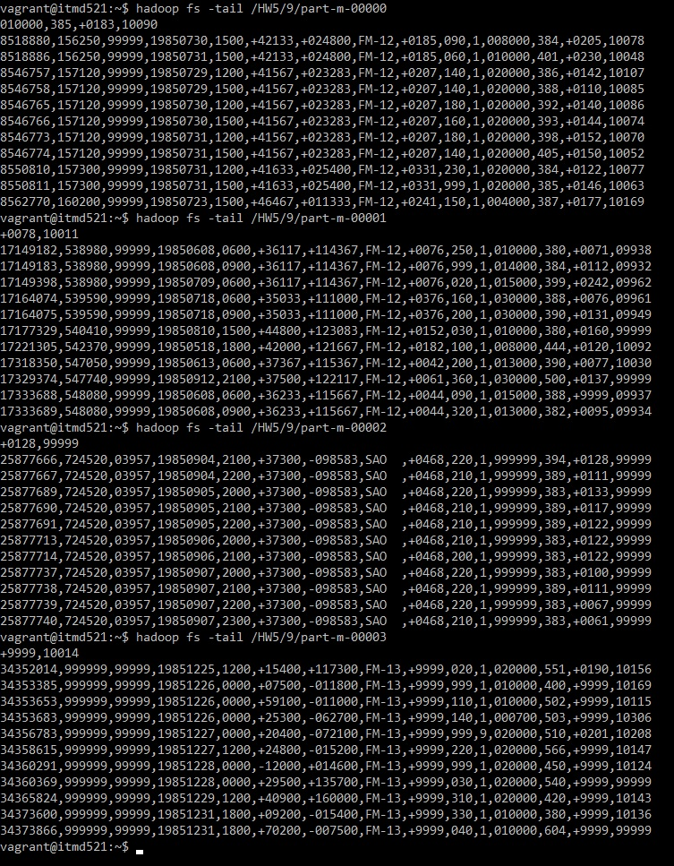

# ITMD 521 Spring 2018

## Week 5 assignment

### Part I

In chapter 15 (up to page 390 in the ePub edition -- stop at the heading **Text and Binary Formats**)  You are to install Sqoop binary on your local Hadoop Cluster (Vagrant Box).  You are to use the  WHERE clause on page 393 (epub) to execute an import from your mysql to hadoop for all records that have temperatures >= 38.0 Celcius  

### Part II 

Upon succesful completion of this operation, use the ```hadoop fs -tail <file>``` command to display the last 10 records of the file (see page 388 epub ) or right before the heading **Text and Binary Formats**.  Place screen shot in the space allocated below.

### Deliverable Instructions

 [Clone my repo](https://github.com/illinoistech-itm/jhajek.git) and use this file as your template.   Add the required photo deliverables to the document as noted and submit your github URL to blackboard.

Include a the command you used to generate the output in a file named: ```sqoop.sh```  

### Deliverable 1

#### One Map Task:
sqoop import --connect jdbc:mysql://localhost/itmd521 --table records -m 1 --username root -P --where "temperature >= 380 and temperature <> 9999" --target-dir /HW5/8

#### Four Map Tasks:
sqoop import --connect jdbc:mysql://localhost/itmd521 --table records -m 4 --username root -P --where "temperature >= 380 and temperature <> 9999" --target-dir /HW5/9


### Deliverable 2

#### Result According to one Map task (-m 1)


#### Result According to four Map tasks (-m 4)


### Additional Notes
* The Database name is itmd521.
* **ATTENTION: 13th column is temperature. **
* I used the condition "temperature >= 380" because according to the dataset description in the book the temperature is Celsius * 10 so 38 degree Celsius in the dataset is equivalent of 380 
* I used **"temperature >= 380 and temperature <> 9999"** condition to prevent the returning results which contain 9999
* When I imported data to MySql, I had not included id column in the table. So, to use more than one Map task I added one id column to records table with the following command:
** ALTER TABLE records ADD id int NOT NULL AUTO_INCREMENT primary key FIRST;
* The first screenshot is the result for one Map task (-m 1) and the second screenshot is the result for four Map tasks (-m 4)