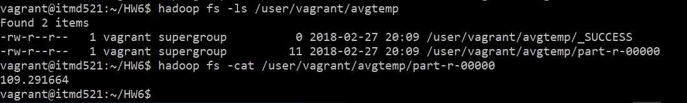
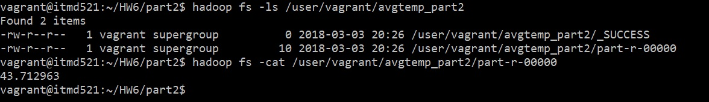

# ITMD 521 Spring 2018

## Week 6 assignment

### Objectives 

* Learn to setup install and configure latest release of Sqoop 
* Learn to install and use the Mysql Connector/J platform 
* Configure and execute a Sqoop import command 
* Configure and run a combined Hadoop/Sqoop job  

### Outcomes 

At the conclusion of this lab you will have gained experience installing, configuring, and executing Sqoop on top of a Hadoop cluster.   You will understand the nature of Sqoop’s connection to mysql as well as how to create a combined Hadoop/Sqoop job to execute importing and analysis in a single command. 

### Part I

Assuming the completion of week 05 homework and a working Sqoop instance and the running of the sample code from chapter 15 MaxWidgitID.java.  You are to use the same syntax to create a Sqoop application that will run the Sqoop import and the MapReduce code in a single class.  You will need to modify the sample code provided in the book.

1) If your last name is **A-K** the mode for temperature per your year 
1) If your last name **L-Z** the average temperature for the year 
1) Execute ```hadoop fs -cat <outputfile>```, place a screenshot of these results (using the year you were assigned) in deliverable 1.

### Part II 

Repeat the work above this time add a ```WHERE``` clause selecting only record number 1000-5000 and temperature between 2 and 20 Celcius. Execute ```hadoop fs -cat <outputfile>```, place the screenshot in delvierable 2. 

### Deliverable Instructions

 Submit the Url to your Github repo to blackboard by 02/22/18 11:59 pm

### Deliverable 1



### Deliverable 2


### Notes
* Dataset comes from **1985**.txt
* The database name is itmd521
* The Database has an **ID** column which is AUTO-INCREMENT. Also, the temperature data type is Integer
* The results is the average temperature based on *Celsius degree * 10*
* In the Mapper I implemented the code that prepare and filter the data and in the Reducer I implemented the code to do the actual business logic (Calculate Average Temperature)
* For Part 0ne and Part Two I used two different files each file contains Mapper, Reducer, and Job: 
 1. AvgTemperature.java** contains the Mapper and Reducer, and Job to produce the result for part 1
 2. AvgTemperatureLimit.java** contains the Mapper and Reducer, and Job to produce the result for part 2
* **ATTENTION:** I did all data filtration and business logics (Average Calculation) in the JAVA codes according to MapReduce rules. In this process, I used some cast operations to convert data to appropriate type. Considering to this point is important that if for each casting operation there is a super small error the final result probably has some margin error to the actual answer because we have more than 30 millions of records.

