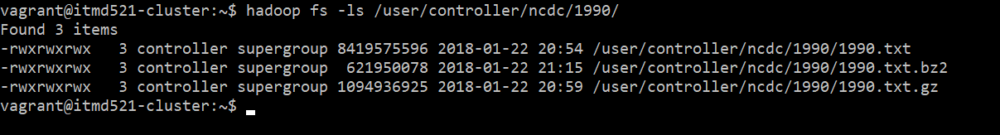
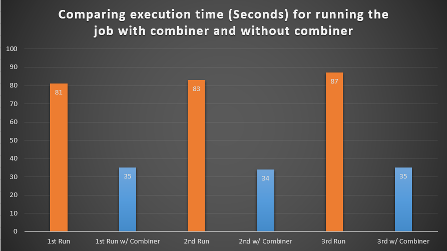
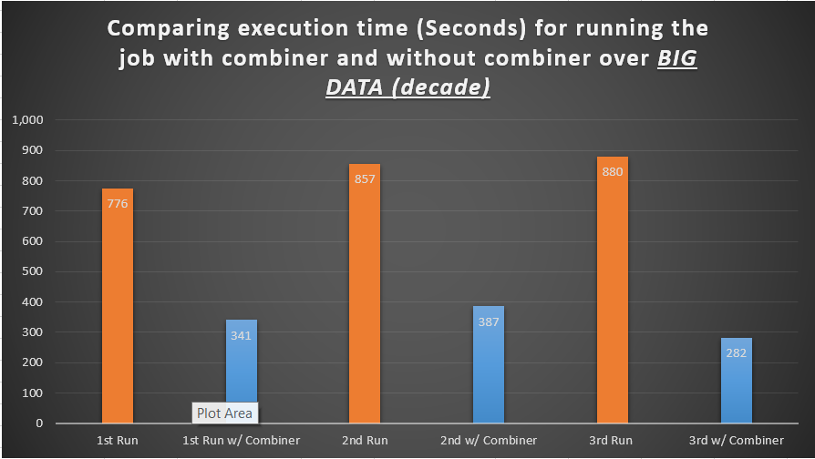
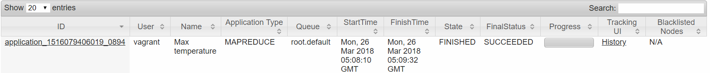
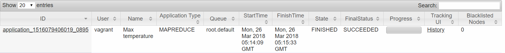
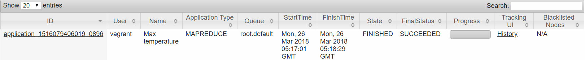
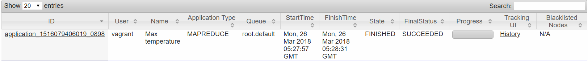

# ITMD 521 Spring 2018

### Deliverable 1


### Deliverable 2

#### Comparing Execution Time (One Year Data)
Here it is a graph which compares the execution times (Based on Seconds) for running the job on small data set (One Year Data Set). 


#### Comparing Execution Time (Ten Years Data)
Here it is a graph which compares the execution times (Based on Seconds) for running the job on big data set (One Decade Data Set). 


#### Results for 1 Year Dataset (SMALL DATA)

##### Small Data - First Run

##### Small Data - Second Run

##### Small Data - Third Run

##### Small Data - With Combiner - First Run

##### Small Data - With Combiner - Second Run

##### Small Data - With Combiner - Third Run


#### Results for 10 Years Dataset (BIG DATA)
##### Big Data - First Run

##### Big Data - Second Run

##### Big Data - Third Run

##### Big Data - With Combiner - First Run

##### Big Data - With Combiner - Second Run

##### Big Data - With Combiner - Third Run


### Deliverable 3
According to the above results, obviously it indicates that running the job with Combiner can reduce the execution time significantly. The reason is that Combiner behaves as a local reducer, so according to **page 198 in chapter 7 of the textbook (PDF Version)**, "Running the combiner function makes for a more compact map output, so there is less data to write to local disk and to transfer to the reducer." So, it can decrease the execution time in Map side.
On the other hand, in the reduce side, "if a combiner is specified, it will be run during the merge to reduce the amount of data written to disk." **(Page 199, PDF Version)**. So, it can reduce the reduce execution time.
As a result, using combiner, can reduce the job execution time significantly, specially when the data set is vary large.

## Additional Notes

* In graphs, the the vertical axis unit is seconds.
* Here there are three results for each job (Small Data without combiner, Small Data with combiner, Big Data without combiner, Big Data with Combiner)
* There are a little bit difference in results of each run for a single job. When the number of jobs which were running at a same time was more than 10 usually it took more time to complete the job.


## Setup Remote Hadoop Cluster Notes

Copy all *.xml and .sh files into your ```~/hadoop-2.6.5/etc/hadoop``` directory overwritting the defaults 

Copy the hosts file content into your ```/etc/hosts file``` -- note ```/etc/hosts``` is owned by root so you need to use ```sudo```
