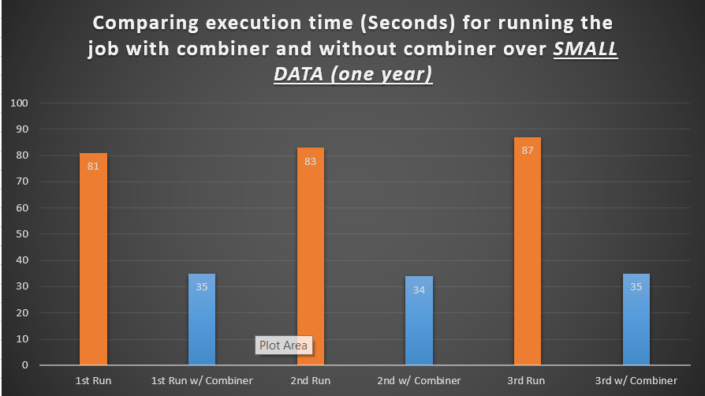

# ITMD 521 Spring 2018

## Week 11 assignment

### Objectives 

* Install and configure industry standard VPN software 
* Configure and connect to industry standard VPN 
* Configure hadoop 2.6.5 installation to connect to a remote Hadoop cluster 
* Understand and analyze the effect of combiners on large MapReduce jobs

### Outcomes 

At the conclusion of this lab you will understand the reasons behind and be able to conenct to a remote network via a VPN.  You will have configured your Hadoop installation to connect to a remote cluster and will have run large scale jobs and analyzed the effect of Reducer classes upon the run time of the job.


### Part I

Assuming that you have succesfully installed, configured, and connected to the remote network via the VPN provided, you need to clone all of the configuration files (see note below) and properly configure you hadoop installation to connect to the remote Hadoop Cluster

Execute this command from your itmd521-cluster vagrant box ```hadoop fs -ls /user/controller/ncdc/1990/``` and take a screenshot of the output.  Place that image in **Deliverable 1** below. 

### Part II 

Compile the MaxTemperature sample code from the hadoop-book chapter 02.  Place the code into a jar file mt.jar (you may already have this step done, which in that case you can reuse mt.jar).  Run the command ```hadoop jar mt.jar MaxTemperature /user/controller/ncdc/YEAROFYOURBIRTH/YEAROFYOURBIRTH.txt``` and ```hadoop jar mt.jar MaxTemperatureWithCombiner /user/controller/ncdc/YEAROFYOURBIRTH/YEAROFYOURBIRTH.txt```

Repeat the above with this command:  ```hadoop jar mt.jar MaxTemperature /user/controller/ncdc/60-70/60-70.txt``` and ```hadoop jar mt.jar MaxTemperatureWithCombiner /user/controller/ncdc/60-70/60-70.txt```

Run each of these three times, capture a screenshot(s) of only these jobs (not others) include them in **Deliverable 2**   This will give you a total of 12 jobs

Note the execution time and graph all of the occurances (six job runs vs time to execute).  Place an image of that graph in **Deliverable 2**

### Part III

Using the textbook and the previous chapters, explain the effect of the reducer upon the outcomes of the job execution time from Part II in technical detail (It is faster or slower is not an acceptable answer).  Cite page sources from the book explaining how you arrived at your answer.

### Deliverable 1


### Deliverable 2

#### Comparing Execution Time (One Year Data)
Here it is a graph which compares the execution times (Based on Seconds) for running the job on small data set (One Year Data Set). 


#### Comparing Execution Time (Ten Years Data)
Here it is a graph which compares the execution times (Based on Seconds) for running the job on big data set (One Decade Data Set). 


#### Results for 1 Year Dataset (SMALL DATA)

##### Small Data - First Run

##### Small Data - Second Run

##### Small Data - Third Run

##### Small Data - With Combiner - First Run

##### Small Data - With Combiner - Second Run

##### Small Data - With Combiner - Third Run


#### Results for 10 Years Dataset (BIG DATA)
##### Big Data - First Run

##### Big Data - Second Run

##### Big Data - Third Run

##### Big Data - With Combiner - First Run

##### Big Data - With Combiner - Second Run

##### Big Data - With Combiner - Third Run


### Deliverable 3
According to the above results, obviously it indicates that running the job with Combiner can reduce the execution time significantly. The reason is that Combiner behaves as a local reducer, so according to page 198 in chapter 7 of the textbook (PDF Version), "Running the combiner function makes for a more compact map output, so there is less data to write to local disk and to transfer to the reducer." So, it can decrease the execution time in Map side.
On the other hand, in the reduce side, "if a combiner is specified, it will be run during the merge to reduce the amount of data written to disk." (Page 199, PDF Version). So, it can reduce the reduce execution time.
As a result, using combiner, can reduce the job execution time significantly, specially when the data set is vary large.

## Additional Notes

* In graphs, the the vertical axis unit is seconds.
* Here there are three results for each job (Small Data without combiner, Small Data with combiner, Big Data without combiner, Big Data with Combiner)
* There are a little bit difference in results of each run for a single job. When the number of jobs which were running at a same time was more than 10 usually it took more time to complete the job.


## Setup Remote Hadoop Cluster Notes

Copy all *.xml and .sh files into your ```~/hadoop-2.6.5/etc/hadoop``` directory overwritting the defaults 

Copy the hosts file content into your ```/etc/hosts file``` -- note ```/etc/hosts``` is owned by root so you need to use ```sudo```
