# ITMD 521 Spring 2018

## Week 12 assignment

### Objectives 

* Understand the effect (positive and negative) of using multiple reducers on an MR job 
* Understand the effect of using Intermediate Compression on an MR job
* Understand the benefit of using custom counters in the output of an MR job 
* Understand how to modify and change the jobname of an MR job

### Outcomes 

At the conclusion of this lab you will have run through a matrix of MR jobs with various optimizations relating to the number of reducers, use of intermediate compression, and the use of a combiner class.  In addition you will modify the sample MR code to include try/catch logic and a custom counter bad and invalid records.


### Part I

Using the single year of your birth, modify the sample MaxTemperature class to include a custom counter to count all bad (malformed) records and count all invalid ranged records (for instance anyhting greater than 50.0 celsius).  Disply the output of these two counters at the end of your MR output and take a screenshot of the output.  Place that image in **Deliverable 1** below. Submit your modified code into week 12 Github folder as well.

### Part II - Reducers

Using the dataset for the year you were born, run the MaxTemperature and MaxTempertature jobs each using 1, and then 2 reducers; four jobs total.

Capture a screenshot(s) of only these jobs (not others) include them in **Deliverable 2**   

Note the execution time and graph all of the occurances.  Place an image of that graph in **Deliverable 2**

Using the textbook and the previous chapters, explain the effect of the reducer upon the outcomes of the job execution time from Part II in technical detail (It is faster or slower is not an acceptable answer).  **Cite page sources from the book explaining how you arrived at your answer.**

### Part III - Reducers Large

Using the linux command [md5](https://en.wikipedia.org/wiki/MD5 "md5") to take a hash of your Hawk ID: ```echo "hajek" | md5sum```.  Take a screenshot of this output and include it in **Deliverable 3**. 

Based on the output string use two datasets mentioned below:

1) If first character is even number: use 50.txt
1) If first character is odd number use: 60.txt
1) If first character is a letter use: 60-70.txt
1) In addition to the above everyone needs to use 60-90.txt as well.

* Enable **intermediate compression**, Page 118 of epub, for all of your MR jobs in this section.
* Compile your code to contain the job.setName("Initials here and a description") value
* Run 8 jobs on each dataset (8x2=16 total), 
* Run your first dataset assigned above: MaxTemperature
    + with 1, 2, 4, 8 reducers
* Run your first dataset assigned above: MaxTemperatureWithCombiner
    + with 1, 2, 4, 8 reducers
*  * Run your second dataset assigned above: MaxTemperature
    + with 1, 2, 4, 8 reducers
* Run your second dataset assigned above: MaxTemperatureWithCombiner
    + with 1, 2, 4, 8 reducers  

Capture a screenshot(s) of only these jobs (not others) include them in **Deliverable 3**   

Note the execution time and graph all of the occurances.  Place an image of those graphs in **Deliverable 3**

Using the textbook and the previous chapters, explain the effect of the reducer upon the outcomes of the job execution time from Part II in technical detail (It is faster or slower is not an acceptable answer).  **Cite page sources from the book explaining how you arrived at your answer.**  

**Submit your *.java files to your repo in week 12 as well.**

Submit your Github repo URL to blackboard by 11:59 pm April 5th.

### Deliverable 1


### Deliverable 2

#### Comparing Execution Time

Here it is a graph which compares the execution times (Based on Seconds) for running the job in the following 4 situations: 
* One Reducer - Without Combiner
* Two Reducer - With Combiner
* One Reducer - Without Combiner
* Two Reducer - With Combiner
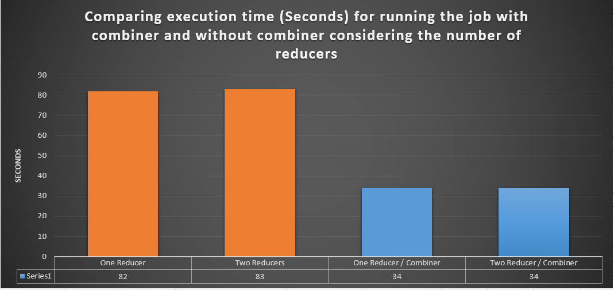

##### Run Job with One Reducer
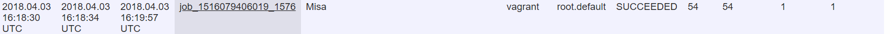
##### Run Job with Two Reducers
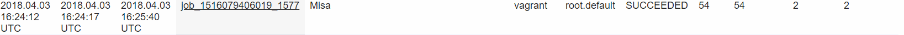
##### Run Job with Combiner and One Reducer
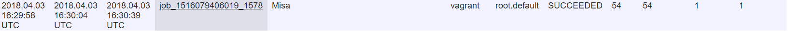
##### Run Job with Combiner and Two Reducers
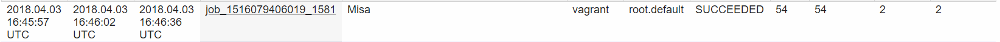


### Deliverable 3

#### Hash of My Hawk ID:

According to the above result, the hash of my hawk id starts with odd number so, I used the 60.txt as the first dataset.

#### Results for 60.txt Dataset

##### Comparing Execution Times 
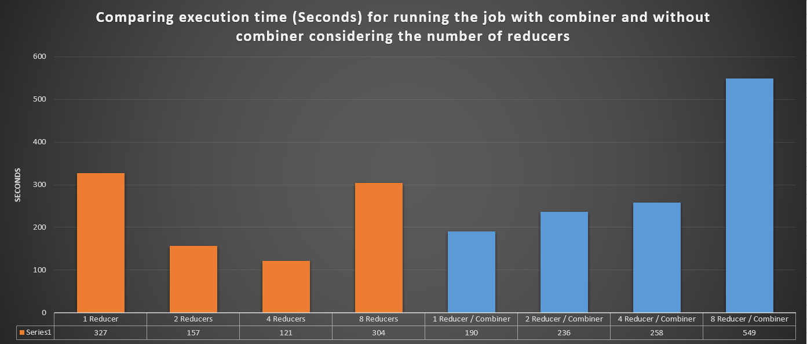

##### Run Job with 1 Reducer 
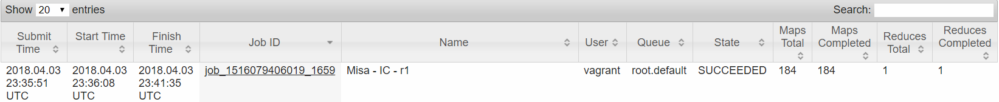
##### Run Job with 2 Reducers 
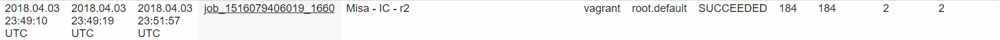
##### Run Job with 4 Reducers 
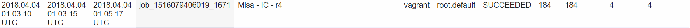
##### Run Job with 8 Reducers 
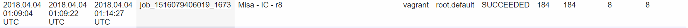

##### Run Job with Combiner and 1 Reducer 
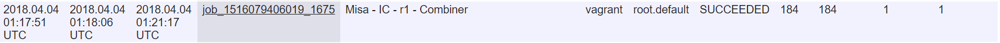
##### Run Job with Combiner and 2 Reducers
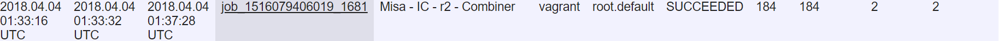
##### Run Job with Combiner and 4 Reducers
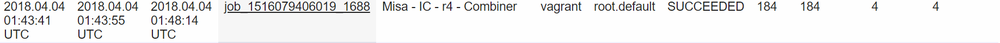
##### Run Job with Combiner and 8 Reducers 
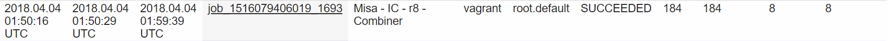

#### Results for 60-90.txt Dataset

##### Run Job with 1 Reducer 
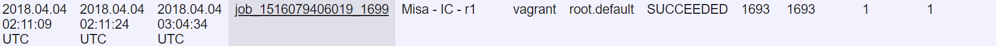
##### Run Job with 2 Reducers 
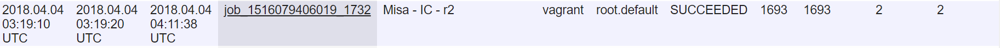
##### Run Job with 4 Reducers 

##### Run Job with 8 Reducers 
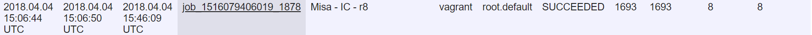

**Chapter 5 Page 108 under "Compressing Map Output" section (PDF Version)**

### Additional Notes

* I set the my Job Names to "Misa"
* In Deliverable 3 I choose 60.txt file as the first dataset because according to hash hawk id, its first number was odd.
* I Enabled **intermediate compression** to run all jobs in Deliverable 3


