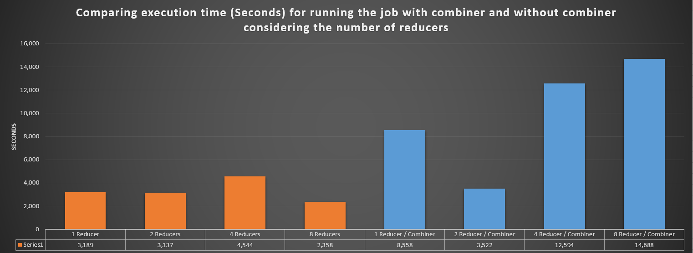
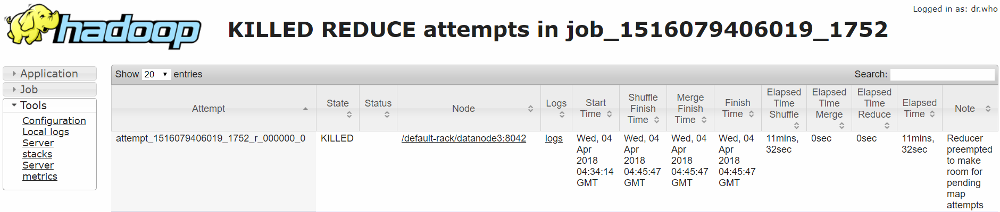

# ITMD 521 Spring 2018

### Deliverable 1

Here is a part of the output which includes three counters:
* **MALFORMED_RECORDS:** Number of all records which contain invalid data or MISSING data or cause the program to throw an exception 
* **TEMPERATURE_OVER_50:** Number of all records which the temperature is more than 50 degree celsius
* **TOTAL_RECORDS:** Total number of all records.

According to the result, the malformed records is approximately %6 of whole data so, we can conclude that the dataset is reliable. 
Moreover, the output of the job indicates in the below screen shot. I used 1983.txt file as dataset.

###### The Java codes which are used to run this part of assignment are in the Part_1 folder of this repo directory.

### Deliverable 2

#### Comparing Execution Time

Here it is a graph which compares the execution times (**Based on Seconds**) for running the job in the following 4 situations: 
* One Reducer - Without Combiner
* Two Reducer - With Combiner
* One Reducer - Without Combiner
* Two Reducer - With Combiner

##### Run Job with One Reducer

##### Run Job with Two Reducers

##### Run Job with Combiner and One Reducer

##### Run Job with Combiner and Two Reducers

#### Analysis the Results
According to **textbook Page 217 on PDF Version** under section **Choosing the Number of Reducers** "Increasing the number of reducers makes the reduce phase shorter, since you get more parallelism. 
However, if you take this too far, you can have lots of small files, which is suboptimal. 
One rule of thumb is to aim for reducers that each run for five minutes or so, and which
produce at least one HDFS block’s worth of output." On the other hand, Having too many or too few reduces is anti-productive. In general we can say:
* Too few reduces cause undue load on the node on which the reduce is scheduled — in extreme cases, we have seen reduces processing over 100GB per-reduce. This also leads to very bad failure-recovery scenarios, since a single failed reduce, has a significant, adverse, impact on the latency of the job.

* Too many reduces adversely affects the shuffle crossbar. Also, in extreme cases it results in too many small files created as the output of the job — this hurts both the NameNode and performance of subsequent Map-Reduce applications who need to process lots of small files. (Ref: https://goo.gl/jgDRHV)

In the above results, The execution times for jobs with combiner aproximately are half of the execution time for jobs without combiner, 
because the Combiners behave as local reducers, so according to **page 198 in chapter 7 of the textbook (PDF Version)**, 
"Running the combiner function makes for a more compact map output, so there is less data to write to local disk and to transfer to the reducer." 
So, it can decrease the execution time in Map side. On the other hand, in the reduce side, "if a combiner is specified, it will be run during the merge to reduce the amount of data written to disk." (Page 199, PDF Version). So, it can reduce the reduce execution time. 
As a result, using combiner, can reduce the job execution time significantly, specially when the data set is vary large.

Moreover, the execution times for jobs with one reducer or two reducers are not so different. The reason maybe is that the amount of data in this dataset(60.txt) is not very very large and also the processing the data is very simple. It includes just finding the max number so the reducers don't have a heavy processing to calculating the result.
###### The Java codes which are used to run this part of assignment are in the Part_2 folder of this repo directory.

### Deliverable 3

#### Hash of My Hawk ID:

According to the below result, the hash of my hawk id starts with odd number so, I used the 60.txt as the first dataset.

#### Results for 60.txt Dataset

##### Comparing Execution Times 

##### Run Job with 1 Reducer 

##### Run Job with 2 Reducers 

##### Run Job with 4 Reducers 

##### Run Job with 8 Reducers 

##### Run Job with Combiner and 1 Reducer 

##### Run Job with Combiner and 2 Reducers

##### Run Job with Combiner and 4 Reducers

##### Run Job with Combiner and 8 Reducers 

#### Results for 60-90.txt Dataset

##### Comparing Execution Times 

##### Run Job with 1 Reducer 

##### Run Job with 2 Reducers 

##### Run Job with 4 Reducers 

##### Run Job with 8 Reducers 

##### Example of Output Results (Output for the job with 8 reducers)

#### Analysis the Results
According to textbook **Chapter 5 Page 108 under "Compressing Map Output" section (PDF Version)**, "the map output is written to disk and transferred across the network to the reducer nodes", 
so by applying intermediate compressing we "can get performance gains simply because the volume of data to transfer is reduced." 
Moreover, according to **textbook Page 217 on PDF Version** under section **Choosing the Number of Reducers** "Increasing the number of reducers makes the reduce phase shorter, since you get more parallelism. 
However, if you take this too far, you can have lots of small files, which is suboptimal. 
One rule of thumb is to aim for reducers that each run for five minutes or so, and which
produce at least one HDFS block’s worth of output." On the other hand, Having too many or too few reduces is anti-productive:
* Too few reduces cause undue load on the node on which the reduce is scheduled — in extreme cases, we have seen reduces processing over 100GB per-reduce. This also leads to very bad failure-recovery scenarios, since a single failed reduce, has a significant, adverse, impact on the latency of the job.

* Too many reduces adversely affects the shuffle crossbar. Also, in extreme cases it results in too many small files created as the output of the job — this hurts both the NameNode and performance of subsequent Map-Reduce applications who need to process lots of small files. (Ref: https://goo.gl/jgDRHV)

The reason why the execution time for running the job with combiners are high is because according to history server, "Reducer preempted to make room for pending map attempts". It means that because the dataset was so large and
at a same time there were a lot of other jobs was running the scheduler wait the job (bigger job) to make empty room for smaller jobs to do and after that continue to finish this job so, these jobs take a lot of time (more than normal expectation) to execute

According to textbook **chapter 4 page 90 (PDF Version)** under section **Fair Scheduler Configuration** "The Fair Scheduler attempts to allocate resources so that all running applications get
the same share of resources." "To understand how resources are shared between queues, imagine two users A and B,
each with their own queue (Figure 4-4). A starts a job, and it is allocated all the resources
available since there is no demand from B. Then B starts a job while A’s job is still
running, and after a while each job is using half of the resources, in the way we saw
earlier. Now if B starts a second job while the other jobs are still running, it will share
its resources with B’s other job, so each of B’s jobs will have one-fourth of the resources,
while A’s will continue to have half. The result is that resources are shared fairly between
users."

###### The Java codes which are used to run this part of assignment are in the Part_3 folder of this repo directory.

### Additional Notes

* Java codes for each part are in the related folder in this Repo. For example the java codes that I used to run job in Part one is in the Part_1 folder.
* In Deliverable 3 I choose 60.txt file as the first dataset because according to hash hawk id, its first number was odd.
* I Enabled **intermediate compression** to run all jobs in Deliverable 3

