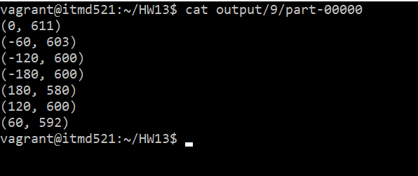

# ITMD 521 Spring 2018

## Week 13 Spark Assignment

### Objectives 

* Understand how to deploy a local Spark Cluster
* Understand the differences and similarities between MapReduce and Spark
* Understand the SparkContext concept 
* Understand how to use PySpark and Spark-Shell to process big data into meaningful results

### Outcomes 

At the conclusion of this lab you will have a basic understanding of the terminology and concepts of Spark and its advantages and disadvantages over the MR platform

### Part I

In chapter 19 of the textbook, you are to install the Spark open-source cluster-computing framework on your local Hadoop Cluster (Vagrant Box). 

Using these datasets, as a basis using your python script from earlier in the semester, create a hybrid data set containing only, **longitude**, **air temperature**, and **air temperature quality code**, seperated by a **TAB**, **/t**

* A-E 1997.txt 1997.txt.xz
* F-R 1950.txt 1950.txt.xz
* S-Z 1985.txt 1985.txt.xz

Provide a spark script (in either python or scala) that will find the max temperature per 10 degree of longitude (agregate the ranges so 20.000 to 29.999, 30.000 to 39.999, for example)

### Deliverable 1

Submit your Github repo URL to blackboard by 11:59 pm April 19th.

In your Week-13 folder include all scripts and program instructions needed to retrieve and reproduce your results.  Upload your part-r-0000 file (results) as well)  Write and instruction/assumptions needed in the Assumption section below.

### Assumptions 1

### Deliverable 1
The below is a screens hot of the out for part-00000. Also, I have uploaded the actual part-00000 file to this repository.

### Assumptions 1

* First I used python to read the txt file and extract the longitude, air quality, and temperature to put them to a new text file. Also, I did the necessary data preprocessing and data filtration in this step.
* Then, I used the python to run the job in Spark
* I applied spark-submit --master local /vagrant/HW13/MaxTemperature.py dataset.txt output/ command to run the job in Spark.
* In the output, each row represents the 10 degree of longitude. For example, (60, 592) means that the max temperature in longitude degree between 60.000 and 60.9999 is 59.2 Celsius.