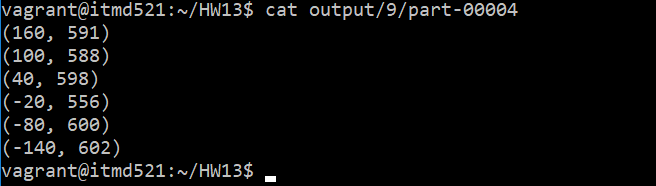

# ITMD 521 Spring 2018

### Deliverable 1

Submit your Github repo URL to blackboard by 11:59 pm April 19th.

In your Week-13 folder include all scripts and program instructions needed to retrieve and reproduce your results.  Upload your part-r-0000 file (results) as well)  Write and instruction/assumptions needed in the Assumption section below.

### Assumptions 1

### Deliverable 1
The below is a screen shot of the part-00000 file. Also, I have uploaded the actual part-00000 file to this repository.

Also, the below a screen shot of the part-00004 file

**The complete output is:**

(-180, 600)
(-170, 607)
(-160, 607)
(-150, 602)
(-140, 602)
(-130, 575)
(-120, 600)
(-110, 600)
(-100, 585)
(-90, 602)
(-80, 600)
(-70, 604)
(-60, 603)
(-50, 600)
(-40, 600)
(-30, 520)
(-20, 556)
(-10, 600)
(0, 611)
(10, 603)
(20, 555)
(30, 601)
(40, 598)
(50, 604)
(60, 592)
(70, 611)
(80, 558)
(90, 593)
(100, 588)
(110, 601)
(120, 600)
(130, 605)
(140, 607)
(150, 555)
(160, 591)
(170, 580)

### Assumptions 1

* First I used python to read the txt file and extract the longitude, air quality, and temperature to put them to a new text file. Also, I did the necessary data preprocessing and data filtration in this step.
* Then, I used the python to run the job in Spark
* I applied spark-submit --master local MaxTemperature.py dataset.txt output/ command to run the job in Spark.
* In the output, each row represents the 10 degree of longitude. For example, (60, 592) means that the max temperature in longitude degree between 60.000 and 60.9999 is 59.2 Celsius.
* The acctual output files are in the output folder of this repository directory.
* As an extra work, I run the Spark job with the java file too. I uploaded the java file as MaxTemperature.java so, totally I run the spark two times one with python and one with java just for extra work a learn more stuff by myself.
